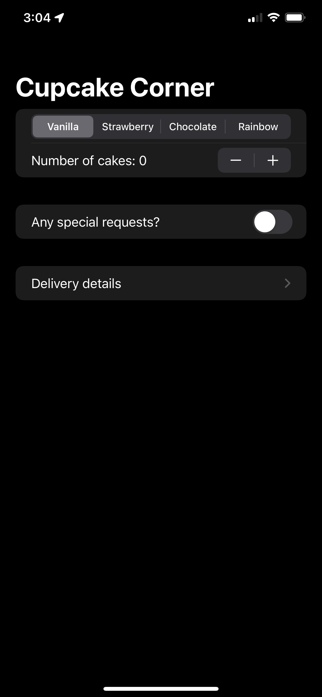
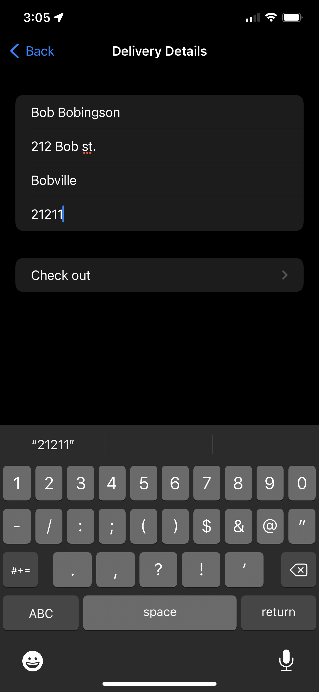

# CupcakeCorner
Store orders app mockup. Project 10 days 49-52 of 100 days of swiftUI.

This app is a simple mockup of an ordering system with networking, async work, and data processing.

   

The lines for the challenges in this project are not labeled, but should be easily found, please feel free to read an implement the code for yourself, just remember to keep focusing on learning!

## TODO 
1. The code is a bit mixed when it comes to views and networking, seperating this out would make it more readable.
